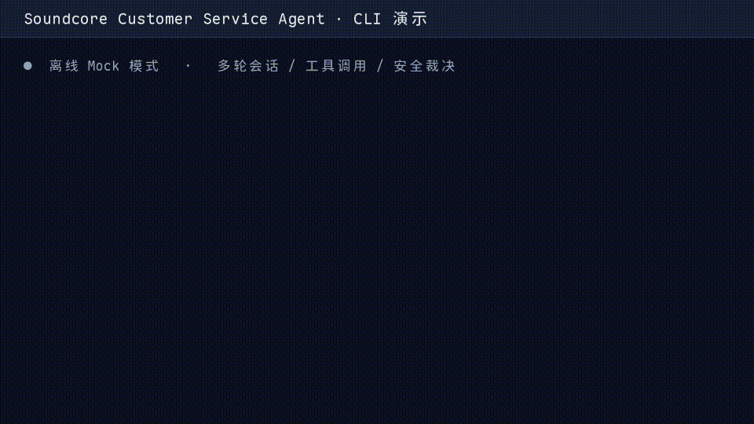
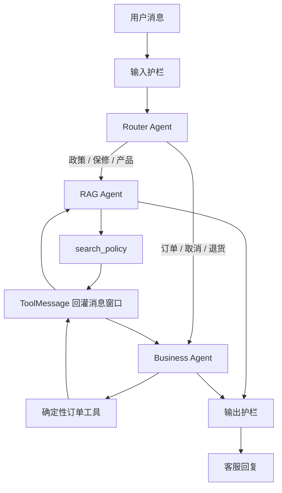
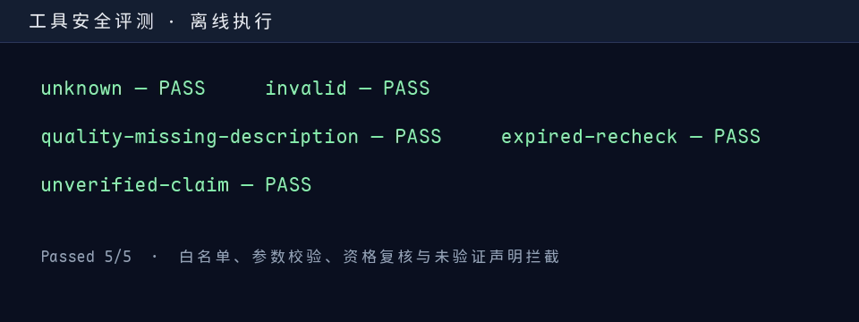

# Soundcore Customer Service Agent

<!-- 发布前将 YOUR_GITHUB_USERNAME 替换为自己的 GitHub 用户名。 -->
[](https://github.com/YOUR_GITHUB_USERNAME/soundcore-customer-service-agent/actions/workflows/ci.yml)

面向售后场景的中文多轮 AI 客服 Agent：通过 **RAG、原生 Function Calling、确定性业务工具和安全护栏**，将“理解用户诉求”和“执行售后动作”分层处理。

> 作品集项目：订单、申请和知识库均为本地 Mock 数据；不包含真实用户或订单信息。



## 核心亮点

| 能力 | 实现方式 |
| --- | --- |
| 多轮 Agent 编排 | Router 根据上下文分流到政策 RAG Agent 或售后业务 Agent；工具结果以 `ToolMessage` 回灌消息窗口。 |
| LLM 与业务裁决分离 | LLM 负责意图理解、追问与工具编排；订单状态、资格检查和申请创建均由确定性代码最终裁决。 |
| 可验证的安全边界 | 输入/输出护栏、工具白名单、Pydantic 参数校验、动作前资格复核和脱敏工具轨迹。 |

## 架构



## 演示流程

主 GIF 使用本地离线 Mock 模式实际运行，展示以下闭环：

```text
我要退货
→ 请提供订单号
→ SC-1003，耳机有杂音
→ check_return_eligibility
→ create_return_request
→ 已创建质量问题售后申请
```

业务工具会强制执行以下规则：

- 未送达订单：创建取消或物流拦截申请。
- 已送达且有质量问题：须提供订单号和问题描述后才能创建申请。
- 已送达且无质量问题：仅官网零售订单、送达后 7 天内可自动创建退货申请。
- 不符合条件：返回可解释的结果码并引导人工客服；模型不能自行声称退款、退货已成功。

## 快速开始

**环境要求：** Python 3.11+。

```bash
git clone https://github.com/YOUR_GITHUB_USERNAME/soundcore-customer-service-agent.git
cd soundcore-customer-service-agent
python -m venv .venv
source .venv/bin/activate
pip install -r requirements.txt
cp .env.example .env
```

填写 `.env` 中的 `DEEPSEEK_API_KEY` 后，可使用模型服务；不填写也可运行本地确定性回退，完成离线 Mock 演示和全部评测。

```bash
PYTHONPATH=. python scripts/chat.py
```

可连续输入：

```text
我要退货
SC-1003，耳机有杂音
```

CLI 会显示脱敏后的工具名、结果码和参数摘要；不会展示内部推理。

## 自动化评测

```bash
PYTHONPATH=. python eval/run_conversation_eval.py
PYTHONPATH=. python eval/run_tool_safety_eval.py
```

两套评测分别覆盖多轮售后闭环，以及工具白名单、参数校验、资格复核和未验证业务声明拦截。GitHub Actions 会在每次推送和 Pull Request 中离线运行它们。



## 面试设计取舍

- **为什么不用模型直接执行退款或退货？**  模型适合理解和编排，但不应成为业务事实的唯一来源；所有会改变订单状态的操作都由确定性工具复核。
- **为什么保留本地回退？**  它使演示与自动化评测不依赖模型密钥或外部服务，便于面试现场复现。
- **如何演进到生产？**  将 Mock 工具替换为订单/工单服务适配层，并增加持久化会话、鉴权、可观测性、限流和人工坐席工作流。

## 项目边界

- 本项目仅用于展示 Agent 工程设计，不接入真实生产系统。
- 会话检查点位于进程内，程序重启后清空。
- 使用模型服务时请将密钥保存在本地 `.env`；该文件已被 Git 忽略，仓库只提供 `.env.example`。

## License

[MIT](LICENSE)
